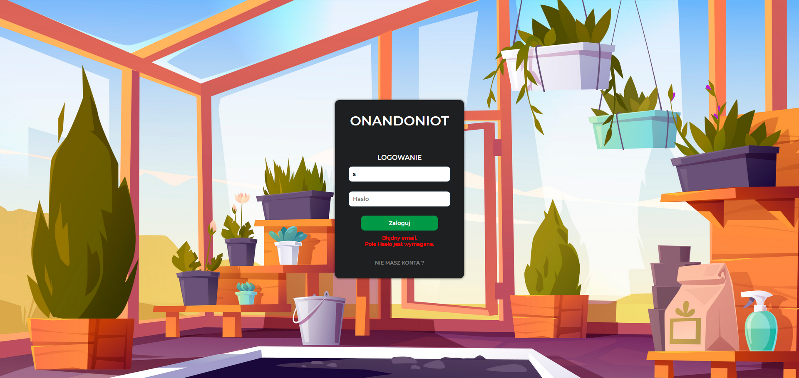
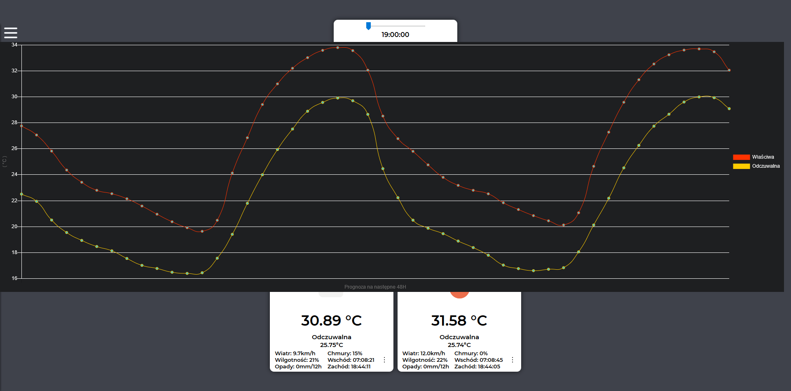

## Technologies

-ReactJs
-Mongoose OS
-Cloud IoT Core
-Cloud Pub/Sub
-Cloud Functions
-Cloud Firestore
-Cloud authentication
-Firebase hosting
-Mqtt
-NodeJs
-ESP32

Only screens because I'm using the paid Blaze.

